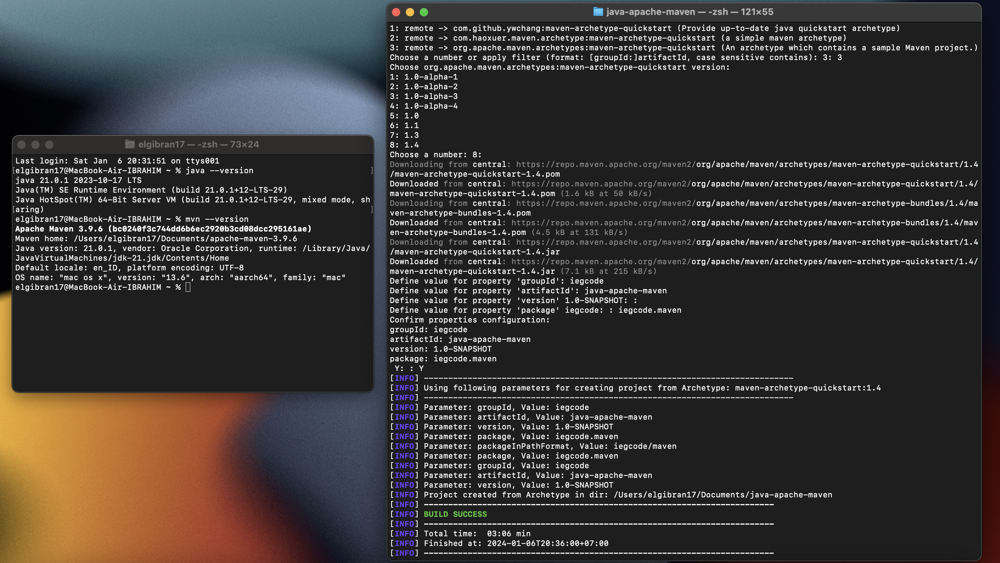
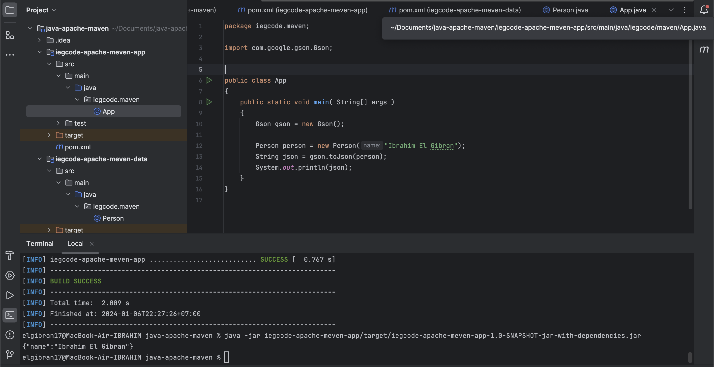

## Apache Maven Project

#### By Step
Installation Maven [`https://maven.apache.org/download.cgi`]()

#### By Step Two
Create Project <br>
- mvn archetype:generate
- maven-archetype-quickstart



#### By Step Three
Search Depedency <br>
- [`https://search.maven.org/`]()
- [`https://mvnrepository.com/`]()


#### Preview
Running Project : 
```bash 
java -jar iegcode-apache-meven-app/target/iegcode-apache-app-1.0-SNAPSHOT-jar-with-depedencies-jar
```

